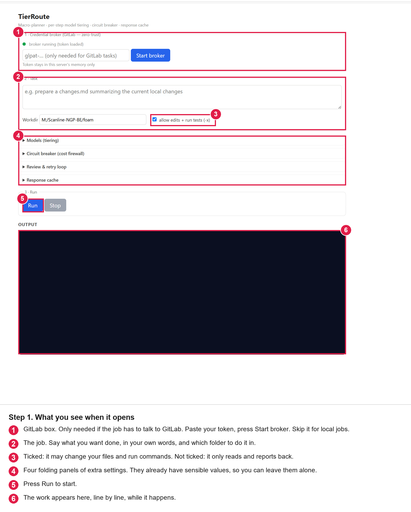
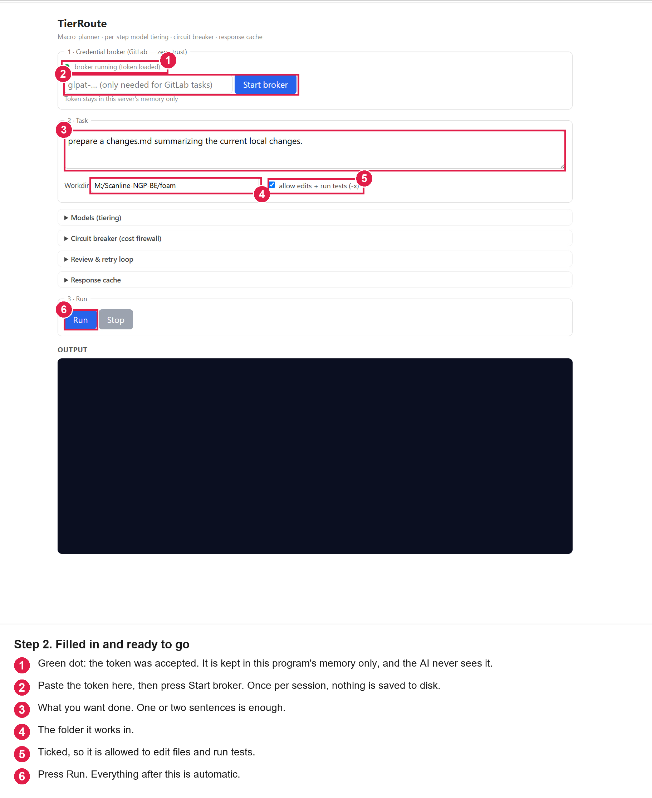
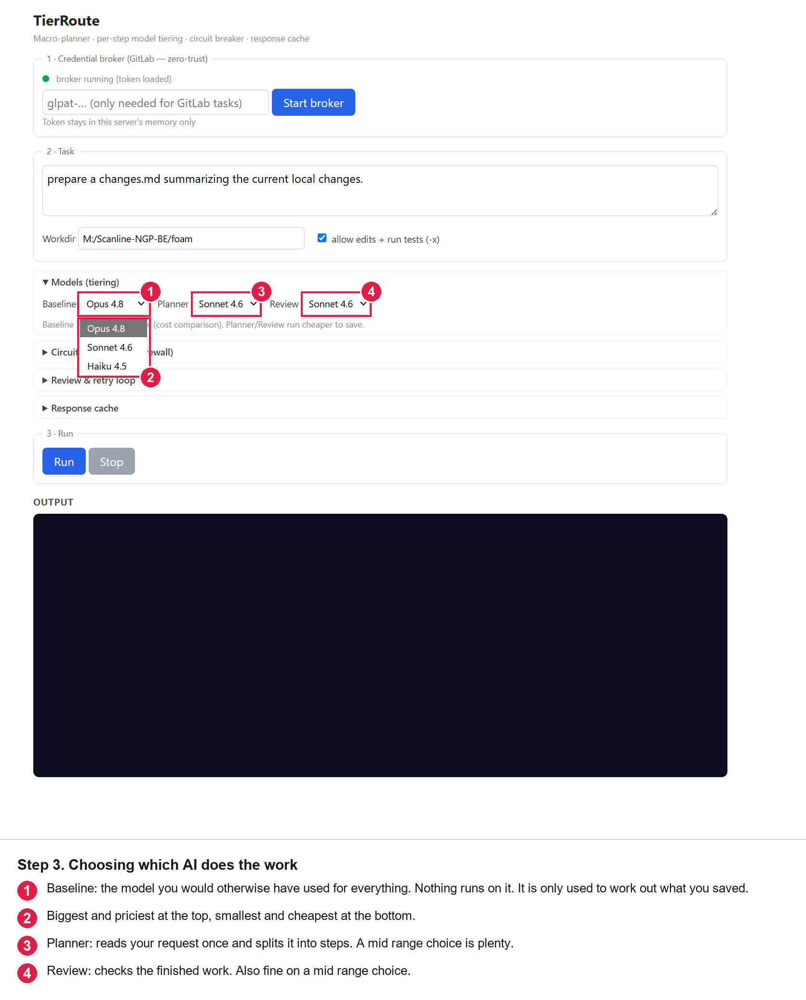
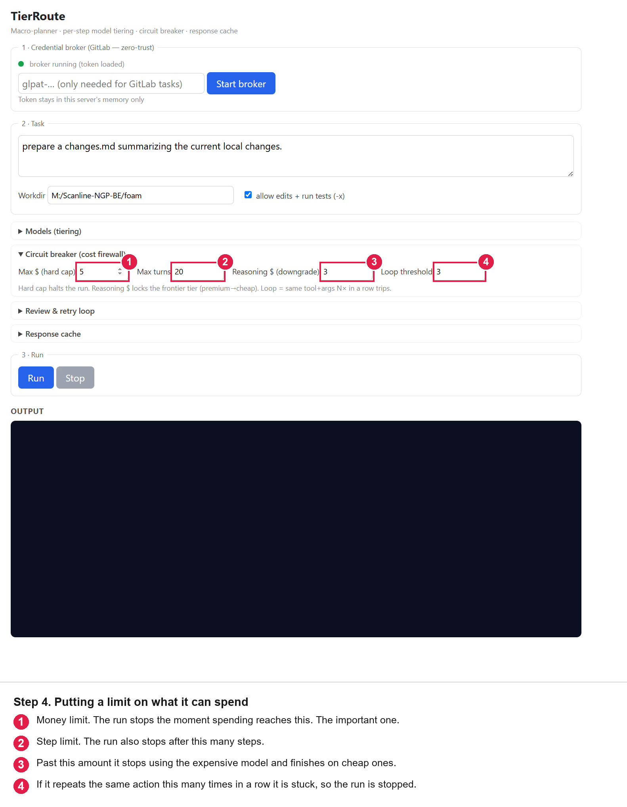
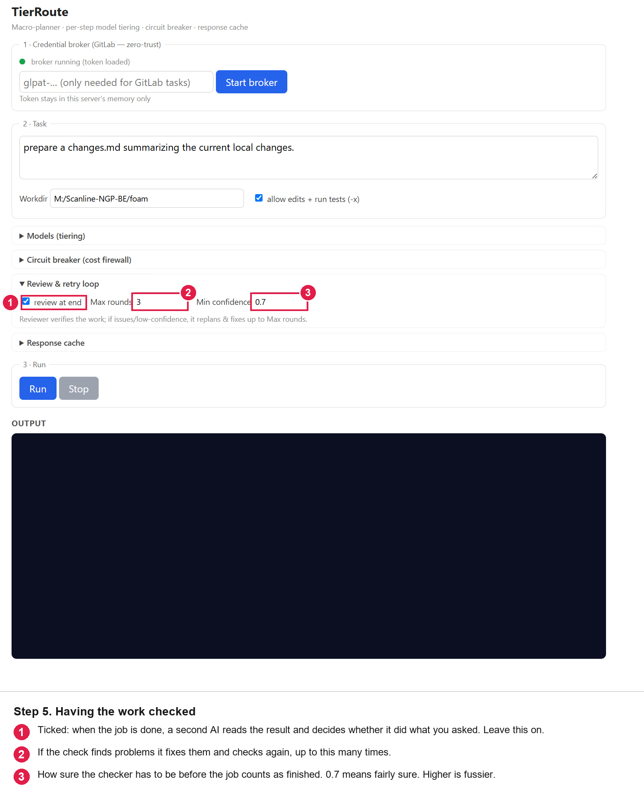
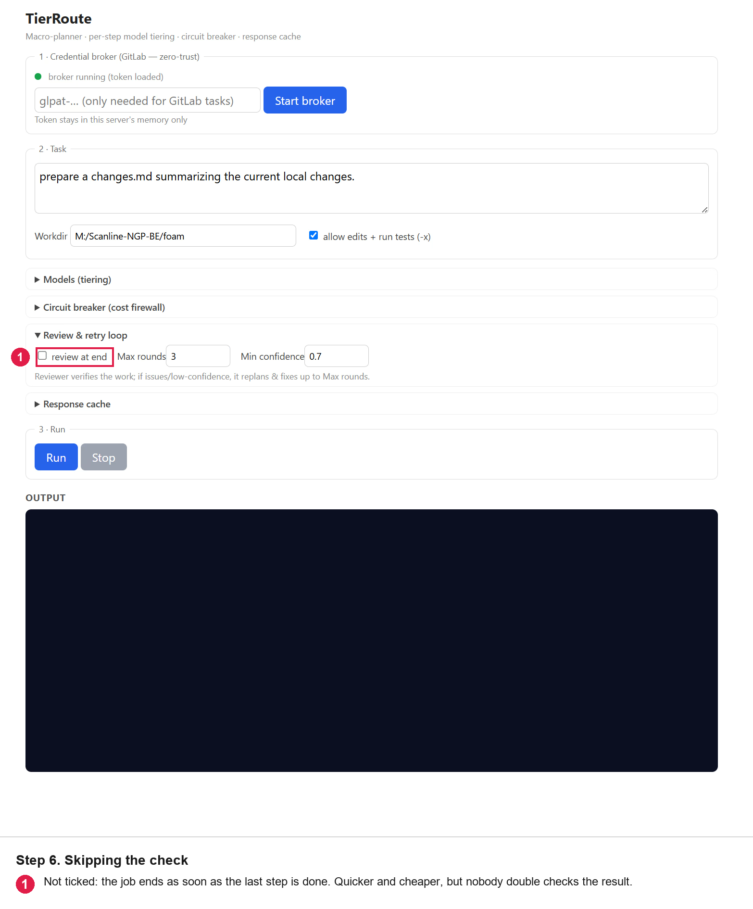
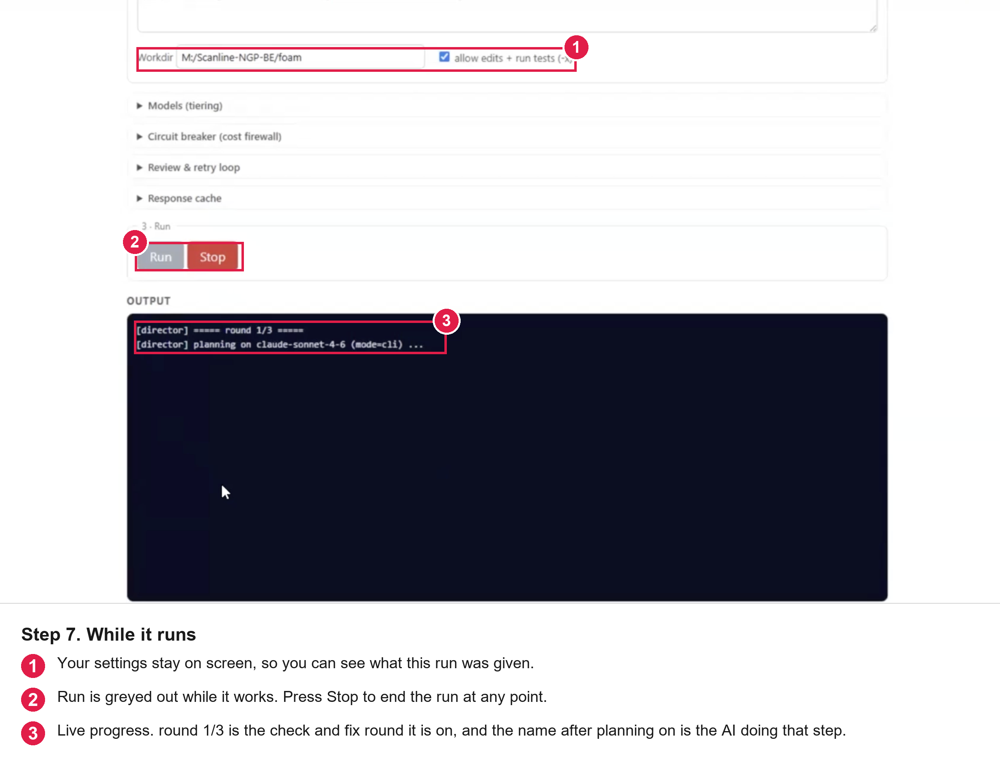
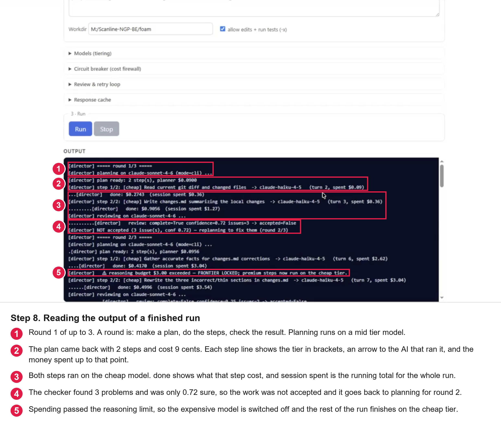

# TierRoute

A local toolkit that makes AI coding agents cheaper and safer to run. Pure Python
3.10+ standard library, with no dependencies and no services to sign up for.

> **GitLab vs GitHub**
>
> The examples in this repo use **GitLab** 
> The same zero‑trust pattern also works for **GitHub**, with these changes:
>
> - Wrap the **GitHub CLI** instead of `glab`  
>   - In `config.json`, add a `tools.github` section with your `host` and `binary`
>   - Use `gh` instead of `glab` in all commands 
>   - For `gh`, inject `GITHUB_TOKEN` into the subprocess environment  
> - Use **GitHub‑style tokens and env vars**  
>   - Set a GitHub PAT in the broker via `GATEWAY_GITHUB_TOKEN` (or your chosen env)  
>   - Inject `GITHUB_TOKEN` into the subprocess environment  
>   - For `git` over HTTPS, inject the appropriate `Authorization` header for GitHub.
> - The broker, policy engine, scrubbing, and audit log are provider‑agnostic.

Three parts:

| Part | What it does |
|---|---|
| **Zero-Trust tool guard** | Lets an agent use `glab`/`git` without ever seeing your access token. The token is held by a separate broker process. |
| **Model Director** | Plans a task once, runs each step on the cheapest capable model, caps runaway cost, reports what you saved. |
| **Web UI** | Drives both from the browser. |

Full details: [`DOCUMENTATION.md`](DOCUMENTATION.md). Director internals:
[`orchestrator/README.md`](orchestrator/README.md).

---

## Quick start

```bash
# 1. Investigate a repo (reads only, no edits, no shell):
python scripts/director.py "why does login time out?" --workdir /path/to/repo

# 2. Implement something (edits files and runs tests):
python scripts/director.py "fix the login timeout" --workdir /path/to/repo --allow-writes --allow-shell

# 3. Or do it all in a browser:
python scripts/ui.py            # http://127.0.0.1:8600
```

[Part 3](#part-3-demo) walks
through the browser window one picture at a time. Every picture has the
explanation printed on it, so you can read them on their own.

The Director drives the local `claude` CLI, so **no API key is needed**. Just make
sure `claude` is on your `PATH`, or set `GATEWAY_CLAUDE_CMD` to your launch command.

> **Note:** Today this targets `claude`; more runtimes will be plugged in behind the
> same interface over time.

Prove the cost guardrail works without spending anything:

```bash
python -m orchestrator.run --selftest --loop-threshold 3
```

All flags: `python -m orchestrator.run --help`.

---

# Part 1. Zero-Trust tool guard

A wrapper around the `glab` and `git` CLIs so an agent can use GitLab **without ever
seeing your access token**.

The token is never in the agent's session. It is held by a separate process, the
**broker**, which is the only thing that ever touches it:

```
Agent session                      Broker process (separate)
  glab-gw mr list                    holds the token in memory
    └─ GATEWAY_BROKER set  ──POST──►  policy-check → inject token → run → scrub
       (no token here)      ◄──────  {exit_code, stdout, stderr}   (no token)
```

Every command the agent asks for goes through four things, all of them on the
broker's side of that line:

1. **A deny-by-default policy**: blocked commands exit `3` and never run
2. **Just-in-time injection**: the token is added for that one call only
   - `glab` → `GITLAB_TOKEN` in the subprocess environment
   - `git` → an `Authorization: Basic base64(oauth2:PAT)` header for that call
3. **Scrubbing**: the token is stripped from all output
4. **An audit line** in `data/tool_audit.log`: the command and the decision, never
   the token

So the token is not in the agent's environment, not in
the git credential store, and not in the agent's context.

## Setup

**1. Start the broker and give it the token.** Run this in its own terminal and
leave it running. The token goes into that process's memory and is never written
to disk:

```bash
python scripts/broker.py
```

`--port` moves it off 8765. Leave `--host` alone: it binds to `127.0.0.1` on
purpose


**2. Set your GitLab host and `glab` path, only if the defaults are wrong.**

No `config.json` ships with the repo. Without one you get the defaults in
`gateway/config.py`: host `gitlab.com`, and whatever `glab` is on your `PATH`. For a
self-hosted GitLab or a `glab` that isn't on `PATH`, create one:

```bash
cp config.example.json config.json
```

| Key (under `tools.gitlab`) | Set it to | Default |
|---|---|---|
| `host` | Your GitLab hostname, no scheme. Sets `GITLAB_HOST` and builds the git remote URL. | `gitlab.com` |
| `binary` | How to launch `glab`: a bare name if it's on `PATH`, otherwise an absolute path. | `glab` |

```json
{
  "tools": {
    "gitlab": {
      "binary": "C:/path/to/glab.exe",
      "host": "gitlab.example.com"
    }
  }
}
```

`config.json` is merged over the defaults, so write only the keys you're changing.
The policy lists carry over. It's gitignored, so your host stays local. Set
`GATEWAY_CONFIG` to load a config from somewhere else.

The broker is the side that runs `glab` and `git`, so this file has to exist
wherever the broker runs. Restart the broker after editing it.

Check it resolved correctly (prints the decision, runs nothing):

```bash
python scripts/glab_gw.py --gw-dry-run mr list
# [tool-guard] ALLOWED (dry-run). Would run: glab mr list
# [tool-guard] token source: $GATEWAY_GITLAB_TOKEN (MISSING)
```

A dry run is answered on the spot and is never forwarded, so in broker mode it
reports the token as `MISSING`. That is the correct answer: the token is in the
broker, not here.

**3. Run the guards instead of `glab` / `git`.**

```bash
python scripts/glab_gw.py mr list
python scripts/git_gw.py  push origin my-branch
```

The broker has to be running for these to work. If it is not, the call fails with
`broker unreachable` and exit code `4`, and nothing is attempted against GitLab.

Add `bin/` to your `PATH` for the short forms `glab-gw` and `git-gw` (a Bash shim and
a Windows `.cmd` are both provided):

```powershell
# replace <REPO> with where you cloned this
[Environment]::SetEnvironmentVariable("Path", [Environment]::GetEnvironmentVariable("Path","User") + ";<REPO>\bin", "User")
```

**4. Clear the token out of the places it no longer needs to be:**
`%LOCALAPPDATA%\glab-cli\config.yml`, and the git credential store. The broker is
the only thing that needs it now, so anything else holding a copy is just extra
exposure.

## Policy

Edit `config.json` (copy `config.example.json`).

**glab**: `tools.gitlab.policy`, allowlist, so anything unlisted is denied:
- Allowed: `mr list/view/diff`, `mr create/update`, `issue list/view`, `repo view/clone`,
  `ci *`, `release list/view`, `api` 
- Denied: `mr merge/delete/close`, `repo delete/archive`, all issue writes,
  `release create/delete`, `auth login/logout`

**git**: `tools.git.policy`, blocklist, since git is mostly local:
- Allowed: `push`, `pull`, `fetch`, `clone`, all local commands
- Denied: `push --force`/`-f`, `push --mirror`, `push --delete`, and the flagless
  equivalents. A `+` refspec (`push origin +main:main`) forces, and an empty source
  (`push origin :branch`) deletes the remote branch
- `push --force-with-lease` stays allowed: it refuses to overwrite work it hasn't seen

Test any command without running it:

```bash
python scripts/glab_gw.py --gw-dry-run repo delete foo/bar     # exits 3
```

## How strong is this

- **Broker as the same OS user** (the setup above, and enough for most people): the
  token is out of the agent's environment, files, config, output, and audit log. What
  is left is that a process running as you could scrape the broker's memory, which is
  a far higher bar than reading a variable.
- **Broker as a separate OS user** (real isolation, needs admin): create a second
  local user, log in or `runas` as that user, and start the broker there with the
  token in *that* user's session, for example
  `python scripts/broker.py --token-env MY_PAT_VAR`. The agent can still POST to the
  broker, but the operating system stops it reading the other user's memory, files or
  environment.
- **Web pages cannot reach it either.** A port on 127.0.0.1 is not private. Any site
  you have open can POST to it, and a `fetch` with a string body needs no CORS
  preflight to get through. So the broker requires a custom header, refuses any
  request carrying an `Origin`, rejects CORS preflights, and requires a loopback
  `Host`, which also defeats DNS rebinding. Details in `DOCUMENTATION.md`.

Either way, the agent can only run policy-allowed commands, and never sees the token.

## Fallback if you cannot run a broker

The guard also works with the token in the agent's own environment. This is weaker
and is not the recommended setup: the token sits in a variable the agent can read
with `echo $GATEWAY_GITLAB_TOKEN`. The policy, the scrubbing and the audit log all
still apply, but the isolation does not. Use it only where a second process is not
an option, for example a short lived container that has no agent in it.

```bash
export GATEWAY_GITLAB_TOKEN=glpat-xxxxxxxxxxxx     # and leave GATEWAY_BROKER unset
```
```powershell
$env:GATEWAY_GITLAB_TOKEN = "glpat-xxxxxxxxxxxx"
```

The guard picks its mode from `GATEWAY_BROKER`: set, and every call is forwarded to
the broker; unset, and it falls back to reading the token in its own process. The
variable it reads is `tools.gitlab.token_env` in `config.json`, which defaults to
`GATEWAY_GITLAB_TOKEN`.

---

# Part 2. Model Director

Give it a task. It plans once, runs each step on the cheapest tier that can handle
it, reviews the result, retries what failed, and prints actual cost against the
baseline of running everything on your expensive model.

```bash
python scripts/director.py "<task>" --workdir /path/to/repo      # read-only
python scripts/director.py "<task>" --workdir /path/to/repo --allow-writes --allow-shell
```

Writes and shell access are **off unless you pass those flags**. Guardrails worth
knowing (all tunable, see `--help`):

| Flag | Effect |
|---|---|
| `--max-cost` | Halt the run once spend hits this dollar figure. Default 10. |
| `--max-turns` | Halt after this many model turns. Default 50. |
| `--loop-threshold` | Trip the breaker when a tool repeats with identical args this many times. Default 3. |
| `--reasoning-budget` | Past this spend, stop using the premium tier. |
| `--no-cache` / `--clear-cache` | Disable or reset the response cache. |

---

# Part 3. The browser window, step by step

If you would rather click buttons than type flags, start the browser window:

```bash
python scripts/ui.py
```

It opens `http://127.0.0.1:8600` by itself. Everything runs on your own machine.

Each picture below has red numbers on it, and the matching notes are printed
under the picture. The same notes are repeated here so you can search them.

## Step 1. What you see when it opens




## Step 2. Filled in and ready to go




## Step 3. Choosing which AI does the work

Open the **Models (tiering)** panel. A big, expensive AI is wasted on easy
steps, so each step goes to the cheapest one that can still do it.




At the end of the run you get two numbers: what the job would have cost on the
baseline, and what it actually cost.

## Step 4. Putting a limit on what it can spend

Open the **Circuit breaker (cost firewall)** panel. These four numbers stop a
job quietly running up a bill.




## Step 5. Having the work checked

Open the **Review & retry loop** panel. When the job is done, a second AI reads
the result and decides whether it did what you asked.




## Step 6. Skipping the check




## Step 7. While it runs




## Step 8. Reading the output of a finished run

Every line in the output panel starts with `[director]`. This is a real run of
*"prepare a changes.md summarizing the current local changes"*, and it shows the
check-and-fix loop and the spending guard both doing their job.



1. **`===== round 1/3 =====`.** Round 1 of at most 3. A round is: make a plan, do
   the steps, check the result. Under it, `planning on ...` names the model that
   is planning.
2. **`plan ready: 2 step(s), planner $0.0900`.** The plan came back with 2 steps
   and the planning itself cost 9 cents. The `step 1/2:` line under it reads left
   to right as: which step, the tier in brackets, what the step is, an arrow to
   the AI that ran it, and the money spent so far.
3. **`done: $0.2743  (session spent $0.36)`.** What that one step cost, then the
   running total for the whole run. Both steps here ran on the cheap model.
4. **`review: ... confidence=0.72 issues=3 -> accepted=False`.** The checker
   found 3 problems and was only 0.72 sure, which is under the 0.7 to 1.0 bar you
   set in Step 5, so the work was rejected and it plans again for round 2. This
   is the retry loop working as intended, not an error.
5. **`reasoning budget $3.00 exceeded, FRONTIER LOCKED`.** Spending passed the
   softer limit from Step 4, so the expensive model is switched off and the rest
   of the run finishes on the cheap tier. The run keeps going, it just gets
   cheaper.

The dotted lines between entries (`....[director]`) are the progress ticks the
window prints while a step is thinking, so a long step never looks frozen.


# Notes

- **Exit codes:** `0` ok or dry-run · `3` policy-denied · `4` misconfigured or the
  broker is unreachable · anything else is the underlying tool's own code.
- Run the tests with `python -m pytest tests`.
